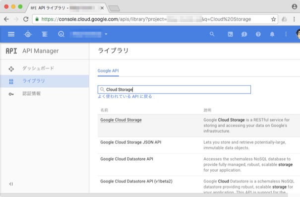

事前準備
==============================

APIを有効にする
------------------------------

GAEからGCSにファイルをアップロードするためにAPIを有効にします。

`管理コンソール <https://console.cloud.google.com>`_ の [API Manager] > [ライブラリ]

検索窓で ``Cloud Storage`` を検索します。

.. image:: _images/enable-clous-storage2.jpg

アップロードに使用するライブラリを準備する
------------------------------------------

GAEからGCSにアップロードするライブラリがあるのでそれを使用します。

`GoogleAppEngineCloudStorageClient <https://pypi.python.org/pypi/GoogleAppEngineCloudStorageClient>`_

   > This library is the preferred way of accessing Google Cloud Storage from App Engine.

.. libディレクトリに `poster <https://pypi.python.org/pypi/poster>`_  ライブラリをダウンロードします。

.. ``poster`` は画像等ををmultipart/form-dataにエンコードするライブラリです。標準のライブラリではできないためライブラリを使用します。

ライブラリをダウンロード
------------------------------

GAEの標準ライブラリを使用する場合はapp.yamlに書けば使えますが、その他のライブラリは `Installing a third-party library <https://cloud.google.com/appengine/docs/python/tools/using-libraries-python-27#installing_a_library>`_ のように特定のディレクトリにライブラリをダウンロードして使用します。

.. code-block:: sh

   $ pip install GoogleAppEngineCloudStorageClient -t lib

``pip`` というPythonの管理ツールを使用します。 ``-t dir`` で指定のディレクトリにダウンロードします(ここではlibディレクトリ)
。
