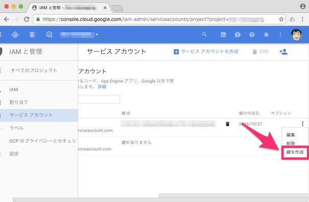

事前準備
==============================

APIを有効にする
------------------------------

Vision APIを使用するにはGCSと同じようにAPIを有効にします。Vision API使用する場合には支払い設定が必要です。
毎月の無料枠もあり1000リクエストまでは無料です。

`管理コンソール <https://console.cloud.google.com>`_ の[API Manager] > [ライブラリ]

検索窓で ``Vision API`` を検索します。

認証情報を取得する
------------------------------

`管理コンソール <https://console.cloud.google.com>`_ の[IAMと管理] > [サービスアカウント]

サービスアカウントのメニューから ``鍵を作成`` を選択して認証情報ファイル(JSON)をダウンロードします。

ダウンロードしたファイルはプロジェクトのディレクトリに保存してください。

.. attention::

   GitHubなど他の人が見れるところにソースを置く場合は、認証情報ファイルを一緒に公開しないようにしてください。

ライブラリをダウンロード
------------------------------

.. code-block:: sh

   $ pip install google-cloud-vision -t lib
   $ pip install google-api-python-client -t lib
